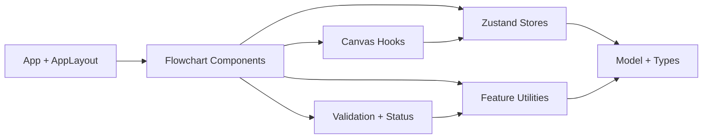

# Clinical Flowchart Editor

Clinical Flowchart Editor is a React + TypeScript application for building and editing clinical decision flowcharts on a pan-and-zoom canvas.

## Quick Start

Prerequisites:
- Node.js 20+
- pnpm 9+

Install dependencies:

```bash
pnpm install
```

Start development server:

```bash
pnpm dev
```

Common commands:

```bash
pnpm build
pnpm lint
pnpm test --run
pnpm test:ui
pnpm test:coverage
```

Note: `pnpm test:coverage` requires a Vitest coverage provider (for example `@vitest/coverage-v8`) to be installed.

## Architecture



Folder map:
- `src/App.tsx`: top-level composition of layout and flowchart feature panels.
- `src/layouts/AppLayout.tsx`: page shell (top bar, side panels, canvas, status bar).
- `src/features/flowchart/components/`: canvas and panel UI components.
- `src/features/flowchart/hooks/`: pointer and viewport interaction logic.
- `src/features/flowchart/state/`: Zustand stores for document and canvas command wiring.
- `src/features/flowchart/model/`: domain types, node type registry, and initial document.
- `src/features/flowchart/utils/`: geometry, validation, and document helpers.
- `src/shared/utils/`: generic utilities shared across features.

## State Ownership Rules

- `flowchartStore` is the source of truth for `document` data (nodes, edges, selection, viewport).
- Mutate flowchart data through store actions (`addNodeOfTypeAt`, `moveNode`, `updateNode`, `setViewport`, and related actions), not ad-hoc component state.
- `canvasCommandStore` is only for transient UI command wiring (for example, left panel action triggering canvas-centered node creation).
- Keep derived display values in components/hooks; keep persistence-worthy state in stores.

## Test Strategy

The test suite is split by behavior layer:
- Utility tests for deterministic pure logic (geometry, validation, viewport math, node creation).
- Hook tests for interaction semantics (dragging, panning, zooming).
- Component tests for integration behavior (controls, panels, status, canvas wiring).

Guidelines:
- Prefer explicit, behavior-focused assertions over implementation details.
- Use named constants in tests for repeat values instead of inline literals.

## Common Extension Points

Add a new node type:
1. Extend `NodeType` in `src/features/flowchart/model/types.ts`.
2. Add metadata/defaults in `src/features/flowchart/model/nodeTypes.ts`.
3. Update defaults in `src/features/flowchart/utils/createNode.ts` when needed.
4. Add or update tests for type rendering and creation flow.

Extend canvas interactions:
1. Update pan/zoom behavior in `src/features/flowchart/hooks/useCanvasPanZoom.ts`.
2. Update node dragging behavior in `src/features/flowchart/hooks/useNodeDrag.ts`.
3. Keep interaction thresholds and clamp behavior covered by tests.

Extend validation and status output:
1. Add validation rules in `src/features/flowchart/utils/validateFlowchart.ts`.
2. Surface validation outcomes in `src/features/flowchart/components/status-bar/StatusBar.tsx`.
3. Add matching tests for both utility output and status presentation.
